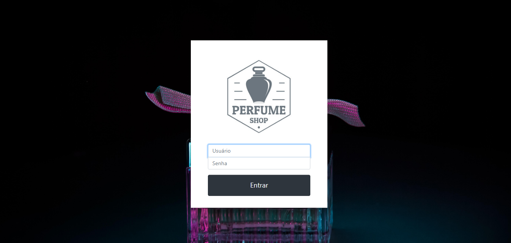
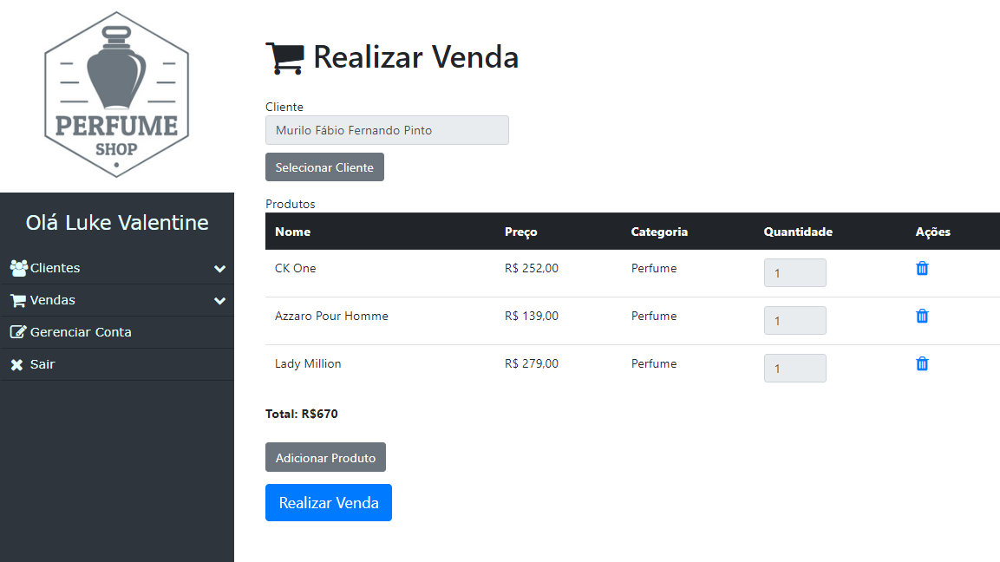
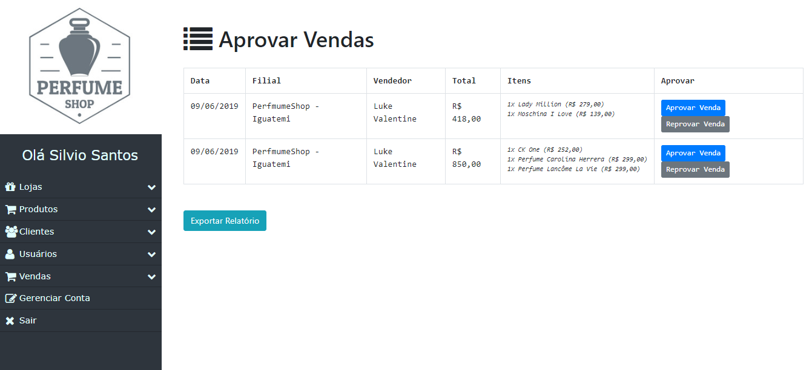
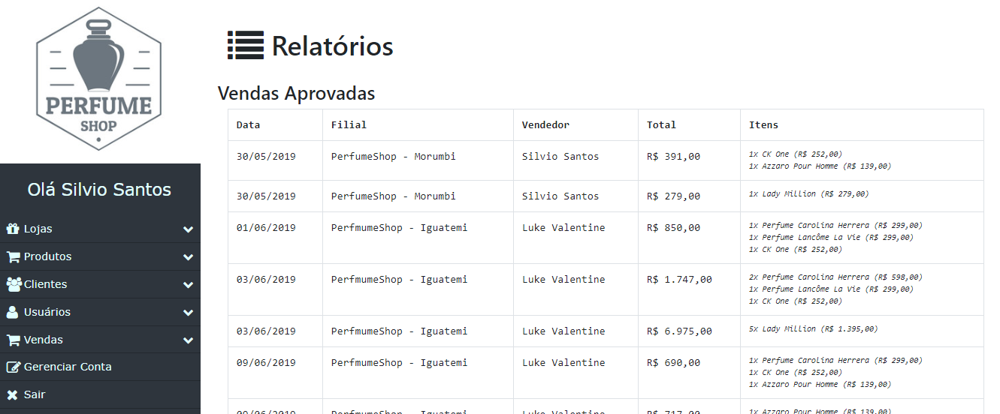
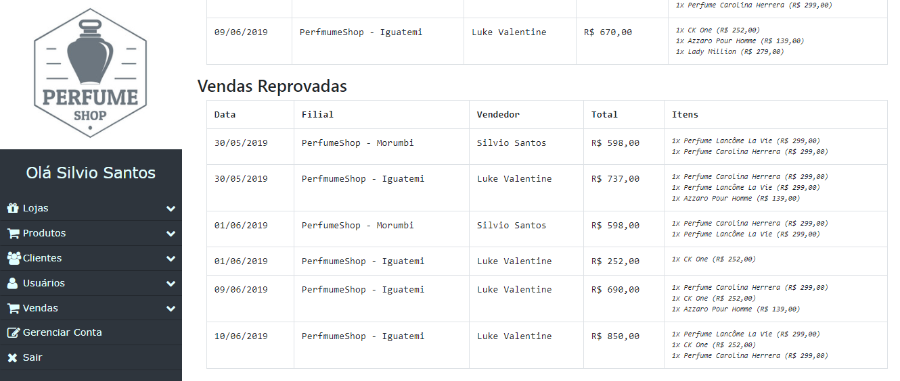

# EXERCICIO-ERP
Sistema ERP com fluxo de venda com aprovação e reprovação

## Componentes:
+ Douglas Brito
+ Guilherme Fernandes
+ Leticia Siqueira
+ Marina Fraga
+ Victor Galvão

## Fluxo do Sistema

### Passo 1: Realizar o login com o perfil de Vendedor

### Passo 2: Realizar uma venda

### Passo 3: Realizar o login com o perfil de Gerente

### Passo 4: Aprovar/Reprovar a venda de algum produto

### Passo 5: Rellatório com as vendas aprovadas e reprovadas

## Instalação do projeto
+ Subir um banco de dados MySQL e rodar o arquivo.sql do projeto
+ Alterar as configuraçoes de conexão do banco no arquivo ConnectionFactory.java
+ Rodar o projeto Maven em alguma IDE
+ Acessar o sistema

